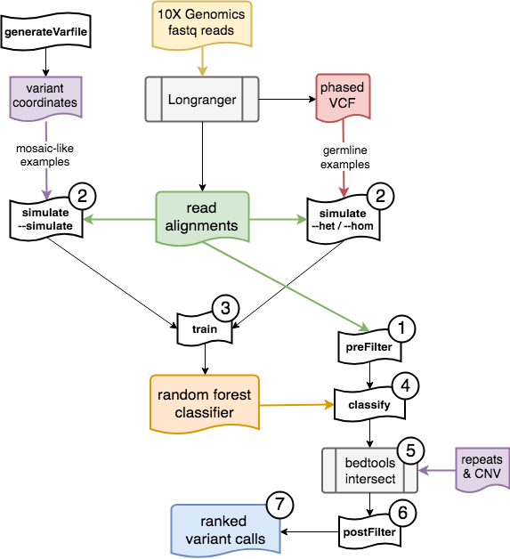

<p align="center">

</p>

**Samovar** is a mosaic SNV caller for 10x Genomics linked-read WGS data. Starting from the [phased VCF](https://support.10xgenomics.com/genome-exome/software/pipelines/latest/output/vcf) and [BAM](https://support.10xgenomics.com/genome-exome/software/pipelines/latest/output/bam) files output by [10x Genomics Longranger pipeline](https://support.10xgenomics.com/genome-exome/software/pipelines/latest/what-is-long-ranger), Samovar first selects candidate variant sites by filtering sites based on features of the aligned reads, such as the depth of coverage, that contribute to false positive variant calls (1). A [random forest tree model](http://scikit-learn.org/stable/modules/generated/sklearn.ensemble.RandomForestClassifier.html#) is trained (3) with simulated mosaic variants as positive examples (2) and real homozygous/heterozygous variants (2) called in the sample by Longranger as negative examples. Candidate variant sites are scored with this model (4). Repeat regions and non-diploid copy-number regions are optionally filtered out (5) before a final filter removes false positives resulting from alignment errors (6) to produce scored variant calls (7).  

<p align="center">
  
</p>

# Dependencies and Configuration

Requires: Python (v.3 recommended, v.2 compatible) with [pyfaidx](https://github.com/mdshw5/pyfaidx); [scikit-learn](http://scikit-learn.org/); [simplesam](http://simplesam.readthedocs.io/en/latest/); [fisher](https://pypi.org/project/fisher/); and installations of [samtools](http://www.htslib.org/), [bedtools](https://github.com/arq5x/bedtools2/releases). Some steps are compatible with [pypy](https://pypy.org/)  
[MARCC](https://www.marcc.jhu.edu/) The SLURM sbatch parameter --ntasks N should be set to accompany Python script parameter --nproc N  

# Installation

* Change the INSTALLDIR, PYTHONCMD, and PYPYCMD variables in the file to match the location of the Samovar code and the command-line invocations of Python and pypy you wish to use. If you do not have pypy, just set PYPYCMD to the Python command-line invocation.  
* The `./samovar` file can then be moved to your `/bin/` directory, or you can add the location to the PATH variable.  
* Download the region filter BED files [here](http://labshare.cshl.edu/shares/schatzlab/www-data/samovar/)
* Install required packages: `pip install -r requirements.txt`

# Main Pipeline

`./samovar`  
Options: generateVarfile, simulate, train, preFilter, classify, postFilter (run without options to see arguments)  

## samovar generateVarfile
**Generates a tab-separated file with fields** `contig \t site \t VAF` **to specify where mosaic-like sites will be simulated**

```
samovar generateVarfile --out out.varfile --vcf sample.vcf --fai genome.fa.fai
```  

`--out` output varfile name [out.varfile]  
`--vcf` sites to avoid in simulation, e.g. the VCF from your sample (takes comma-separated multiple file names)  
`--fai` FASTA file index of the genome from `samtools faidx`  
`--variantspacing` spacing along the genome of simulated sites [80000]  
`--vafspacing	` increment of variant allele fraction [0.05]  

**Notes:**   

*  25,000-30,000 mosaic-like sites are suggested. Running this step with --variantspacing 80000 usually results in enough sites output from the simulation step. Decrease --variantspacing to increase the number of mosaic-like sites.  
*  This step takes only a few minutes, mostly spent reading the VCF file. It is not parallelized and pypy is not necessary.  
*  If you do not want to use miscellaneous contigs and/or sex chromosomes, make a new file for the `--fai` argument that contains only the contigs you want to use for mosaic-like sites.


## samovar simulate
**Simulates mosaic-like training examples at sites specified in varfile where there is at least one haplotype-discordant read**

```
samovar simulate --bam sample.bam --varfile out.varfile --simulate --nproc 4 > mosaic.features.tsv
```

`--simulate` mosaic site simulation mode  
`--bam` bam file to simulate sites from  
`--varfile` varfile from `0.setup/generateVarfile.py` of sites and VAF  
`--nproc` uses `multiprocessing.Pool` (value <= 1 does not import the module and runs in serial)  


**Notes:**   

* Records are printed to stdout, the output order may differ from the input order if multiple processes are used  
* With pypy, 4 processes, and 30,000 sites in the varfile, this step takes 30 minutes. (SLURM shared partition default memory 5G/task is sufficient)  
 
**Computes features at known homozygous/heterozygous sites from VCF that have at least one haplotype-discordant read**  

```
samovar simulate --bam sample.bam --varfile sample.vcf --het --max 50000 --nproc 4 > het.features.tsv
```

`--het` will extract features from sites with genotype `1|0\|0|1` that PASS filter and are SNP [i.e. len(ref) == 1 and len(alt) == 1]  
`--hom` will extract features from sites with genotype `0|0\|1|1` that PASS filter and are SNP [i.e. len(ref) == 1 and len(alt) == 1]  
`--bam` bam file to simulate sites from  
`--varfile` sites to extract features from, e.g. the VCF from your sample  
`--max` maximum number of sites to extract features from  
`--nproc` uses `multiprocessing.Pool` (value <= 1 does not import the module and runs in serial)  
Must catch output from stdout.

**Notes:**   

* Records are printed to stdout, the output order may differ from the input order if multiple processes are used 
* Based on the number of mosaic-like sites, you should set --max to half that number in each of --hom and --het mode.  
* Because more sites must be examined to find enough examples with haplotype-discordant reads, with pypy, 4 processes, and --max 15000, this step takes 30-90 minutes for modes --het and --hom. (SLURM shared partition default memory 5G/task is sufficient)  
 
## samovar train
**Uses feature vectors from mosaic-like, heterozygous, and homozygous sites to train a random forest classifier**

```
samovar train --mosaic mosaic.features.tsv --het het.features.tsv --hom hom.features.tsv
```

`--mosaic` file from `--simulate` in `1.simulate/simulate.py`  
`--het` file from `--het` in `1.simulate/simulate.py`   
`--hom` file from `--simulate` in `1.simulate/simulate.py`   Equal number of het and hom examples are randomly selected to give equal number of mosaic and germline training examples.  
`--out` classifier file in Python's pickle binary format [clf.pkl]  
`--mindepth` read coverage required to use a site as a training example [16]    ]
`--nestimators` [100] `maxleafnodes` [50] scikit-learn random forest hyperparameters  
`--modelsize` maximum number of mosaic training examples [None: use all data]

**Notes:** 
 
* Ensure that the python and scikit-learn versions used to train and dump the classifier are the same as used to load and use the classifier later on.
* This step should just take a few minutes, and is not parallelized or pypy-compatible.

## samovar preFilter
**Scans genome, calculates features for sites that pass all filters. Outputs "vectors" for passing sites which will later be classified and ranked by the random forest**

```
samovar preFilter --bam sample.bam --nproc 48 > vectors.txt 2> intervalsComplete.txt
```

`--bam` bam file of your sample  
`--nproc` uses `multiprocessing.Pool` (value <= 1 does not import the module and runs in serial)  


**Notes:**  

* Records are printed to stdout, the output order may not be in order along the genome if multiple processes are used 
* Regions are printed to stderr when they are completed.
* To decrease memory usage at possible loss of speed, decrease the "performance parameters" in the script. WINDOW\_SIZE is the number of bases each task scans at a time. READBATCH and SITEBATCH control how often the main data structure is pruned.    
* To adjust filter thresholds, change the "filter parameters" in the script. To consider sites with more (less) evidence of mosaicism, increase (decrease) MIN\_MAF and MIN\_HAPDISCORD\_READS. To consider sites with more (less) phased reads, increase (decrease) MIN\_FRAC\_PHASED. To consider sites with higher (lower) quality phasing, increase (decrease) MIN\_FRAC\_HAP1, the haplotype imbalance of all phased reads, and decrease (increase) MAX\_HAPDISCORD\_READS\_HAP, the haplotype imbalance of haplotype-discordant reads.  
* If you want to include any contigs besides the autosomes and chrX, add the names to the CONTIGS list. (if the sample is male, the reads on chrX will not have the HP tag from longranger and no calls will be made) 
* Processes have been observed that use >100G of memory on a single interval, and this has not yet been investigated and solved. [MARCC] Use SLURM `--partition=lrgmem --nodes=1 --ntasks-per-node=48 --mem=800G --time=12:0:0` which takes 3-5 hours to scan the whole genome, producing 50,000-100,000 candidate vectors (30-70MB output file).  

## samovar classify
**Uses the random forest model to rank the feature vectors, outputting those with a higher-than-threshold probability in an output file with format:** `contig \t position \t position+1 \t Samovar score \t read depth \t Number of haplotype discordant read \t MAF \t minor allele base`

```
samovar classify --clf clf.pkl --vectors vectors.txt > predictions.tsv
```

`--clf` classifier trained from 2.train/train.py  
`--vectors` output file from filter step   

**Notes:**  

* Records are printed to stdout
* Ensure that the python and scikit-learn versions used to train and dump the classifier earlier the same as used to load and use the classifier here.
* This step should just take a few minutes, and is not parallelized or pypy-compatible.  
* An invocation of `eval()` in the python script may report an unexpected EOF in the middle of the file. Replacing this character with a newline solves the issue, which has not yet been investigated and solved.  
* If you do not want to use miscellaneous contigs and/or sex chromosomes, make a new file for the `--fai` argument that contains only the contigs you want to use for mosaic-like sites.  
* Decrease (set to 0) MIN\_CLF\_SCORE to output more (all) of the sites.  
* About 20,000-30,000 sites should remain after this step with a probability threshold of 0.9.

## Use bedtools to apply region filters
**Filter out simple repeats and CNV**

```
bedtools intersect -v -a predictions.tsv -b repeatsb37.bed | bedtools intersect -v -a stdin -b CNVNATOR.bed > regionfiltered.tsv
```

**Notes:**  

* Our suggested blacklist region is 1,2,3,4-nt repeats at least 4bp long with at least 3 copies of the "unit" with a 2bp buffer, and CNVNATOR calls with a 5bp buffer.  
* This step should only take a few minutes but because there are so many intervals of simple repeats, the memory consumption could be up to 30G unless both files are sorted and the `-sorted` flag is used in `bedtools intersect`.  
* About 5,000-10,000 sites should remain after this step.

## samovar postFilter
**Calculates the minimum Fisher score for association between minor allele reads and mismatches, indels, or alignment endpoints**

```
samovar postFilter --bam sample.bam --bed regionfiltered.tsv --ref genome.fa --vcfavoid sample.vcf --nproc 4 > predictionsFinal.tsv
```

`--bam` BAM file of your sample   
`--bed` variant calls  
`--vcfavoid` VCF of sites NOT to consider for possible linkage (i.e. VCF from your sample)  
`--ref` reference genome FASTA   
`--p` minimum Fisher p-value to report - default 0.005 

**Notes:**  

* Change `--p` to adjust the threshold below which sites will be rejected.  
* This step takes less than 10 minutes with pypy, 4 processes for 8000 sites.
* About 4,000-8,000 sites should remain after this step with a probability threshold of 0.05.

# Utilities


### 0.setup/cnvnator2bed.py
```
python cnvnator2bed.py [infile] [outfile] [.fai of genome]
```  
Converts cnvnator output into a .bed file with +/- 5 buffer around CNV regions


# Example

### example/EXAMPLE.txt

Reads and variants from [Genome in a Bottle NA24385 GRCh38](ftp://ftp-trace.ncbi.nlm.nih.gov/giab/ftp/data/AshkenazimTrio/HG002_NA24385_son/10XGenomics/) extracted by:

```
samtools view -b [input.bam] chr1:200000000-201000000 > example.bam
samtools index example.bam
vcftools --vcf [input.vcf] -c --recode --chr chr1 --from-bp 200000000 --to-bp 201000000 --remove-indels --remove-filtered-all > example.vcf
```

Can replace "python" with "pymp" and/or add "--nproc N" to commands where permitted  
Without pymp or parallelism, the filter step will take about 6 minutes; the rest will take a few seconds each. 
 
```
python ../1.simulate/simulate.py --bam example.bam --varfile out.varfile --simulate > outs/mosaic.features.tsv
python ../1.simulate/simulate.py --bam example.bam --varfile example.vcf --hom  > outs/hom.features.tsv
python ../1.simulate/simulate.py --bam example.bam --varfile example.vcf --het  > outs/het.features.tsv
python ../2.train/train.py --mosaic outs/mosaic.features.tsv --het outs/het.features.tsv --hom outs/hom.features.tsv --nestimators 1 --maxleafnodes 5 --out outs/clf.pkl
python ../3.classifyAndFilter/filter.py --bam example.bam > outs/vectors.txt
python ../3.classifyAndFilter/classify.py --clf outs/clf.pkl --vectors outs/vectors.txt > outs/predictions.txt
python ../3.classifyAndFilter/linkageFilter.py --bam example.bam --bed outs/predictions.txt --vcfavoid example.vcf --ref [GRCh38 reference genome FASTA] > outs/finalPredictions.txt
```

  
# Experiments

Scripts related to experiments in the forthcoming Samovar publication.


